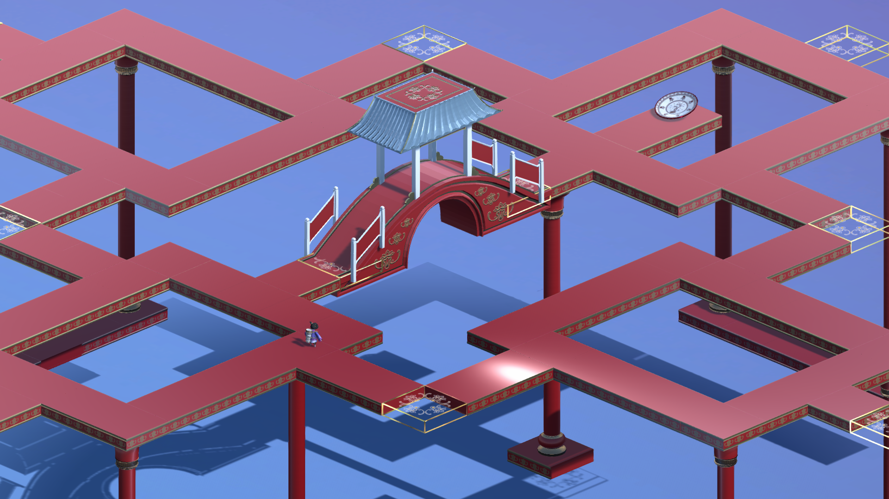
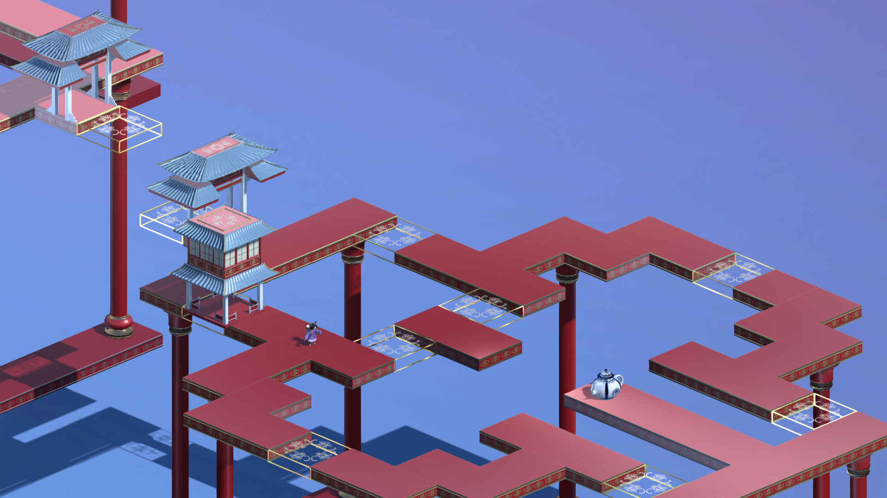

# Summoner
Summoner is a co-operative, two-player platforming game exploring the relationship between tangible and virtual interfaces in games. The game’s environment is inspired by ancient Chinese architecture and aims to showcase elements of Chinese history. Player One plays as a young girl exploring the world, looking for her family’s lost heirlooms. Player Two acts as her protector, summoning structures in the virtual world by touching the corresponding tangible figurines in the physical world.

